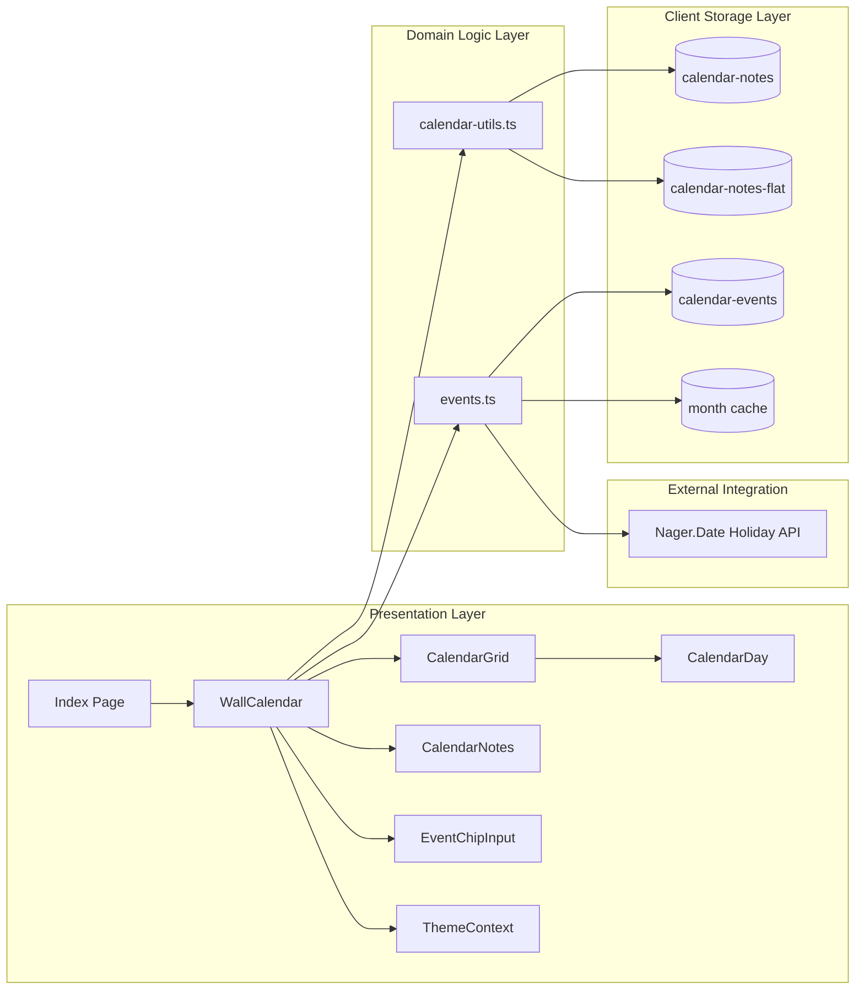
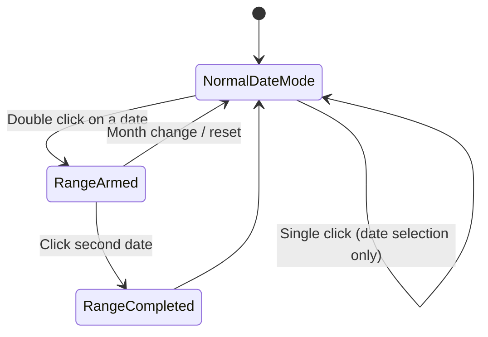

# Digital Wall Calendar


Modern, animated, responsive wall calendar built with React + TypeScript + Tailwind.

It supports:
- month navigation with cinematic page-flip effects
- single-date and range-based note management
- tone-colored notes/events
- event fetching + local cache
- localStorage persistence for user data

## Project Preview


## Tech Stack

- React 18
- TypeScript
- Vite
- Tailwind CSS
- Framer Motion
- Lucide Icons

## Architecture Diagram



### Block Summary

1. Presentation Layer: renders calendar UI and handles user interactions.
2. Domain Logic Layer: computes date/range behavior, note/event transformations, and persistence rules.
3. Client Storage Layer: keeps notes/events and month cache in browser localStorage.
4. External Integration: fetches public holiday data and merges it into month events.

## Range Selection Flow



## Notes Storage Model

Notes are stored in multiple forms for rendering + readability:

1. Structured model (`calendar-notes`):

```json
{
	"monthNotes": {
		"2026-04": "..."
	},
	"dateNotes": {
		"2026-04-07": "..."
	},
	"rangeNotes": {
		"2026-04-05_2026-04-10": "..."
	}
}
```

2. Flat readable mirror (`calendar-notes-flat`):

```txt
dd/MM/yyyy - note
```

Range notes are expanded and mirrored across each date in that range so clicking any included day can render note indicators and date-note content.

## Events Data Flow

1. Events load from `localStorage`.
2. Month events fetch from public holiday API + local holiday sources.
3. Data is merged and deduplicated.
4. Month cache is stored for faster reloads.

## Features Implemented

- Animated month transitions (page-flip style)
- Fixed/compact grid behavior tuning
- Date selection + double-click-triggered range mode
- Month/Date/Range notes context
- Multiple notes per context
- Tone-based note/event color chips
- Dynamic notes/event side panel
- Year jump input (keyboard arrow support)
- Responsive layout (mobile + desktop)
- Light and dark theme support
- Background motion effects (time-travel inspired)

## Folder Guide

- `src/components/WallCalendar.tsx`: calendar shell, navigation, range orchestration, side panel
- `src/components/CalendarGrid.tsx`: weekday headers and month grid transition
- `src/components/CalendarDay.tsx`: per-day visuals, selection state, note/event indicators
- `src/components/CalendarNotes.tsx`: notes UI and contextual save flow
- `src/components/EventChipInput.tsx`: event add/list UI
- `src/lib/calendar-utils.ts`: date helpers, range helpers, note persistence
- `src/lib/events.ts`: event persistence, API fetch, merge logic
- `src/pages/Index.tsx`: page-level layout and animated background

## Getting Started

### 1) Install dependencies

```bash
npm install
```

### 2) Run development server

```bash
npm run dev
```

### 3) Build for production

```bash
npm run build
```

### 4) Preview production build

```bash
npm run preview
```

## Scripts

- `npm run dev` - start dev server
- `npm run build` - create production build
- `npm run preview` - preview production build


